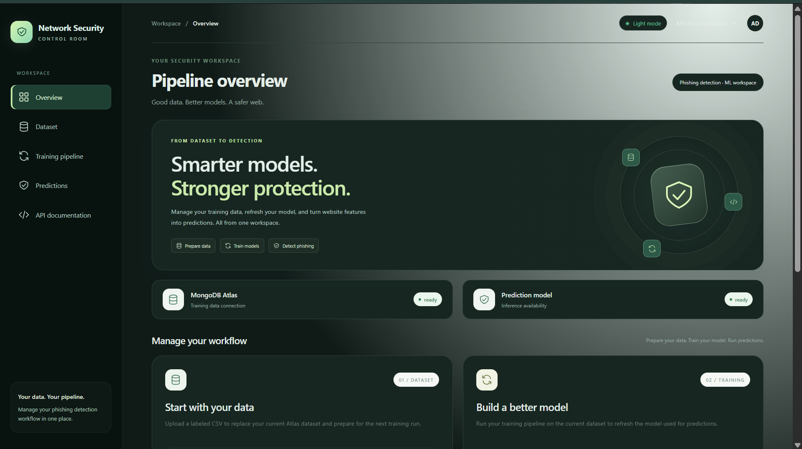
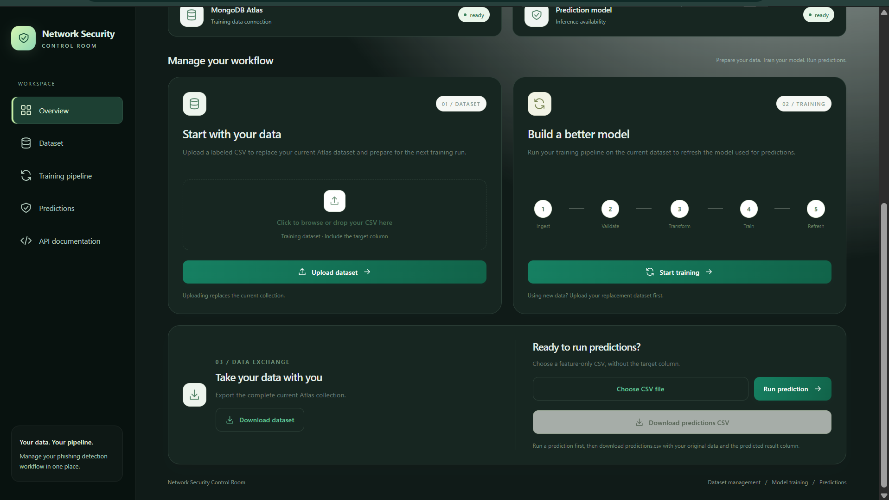
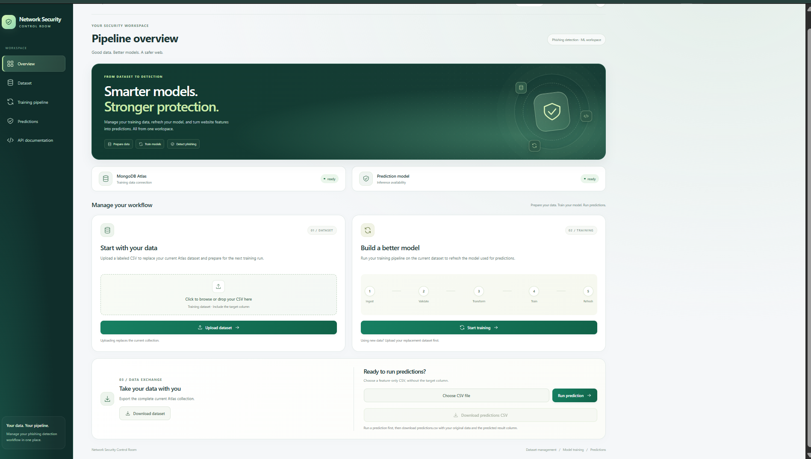
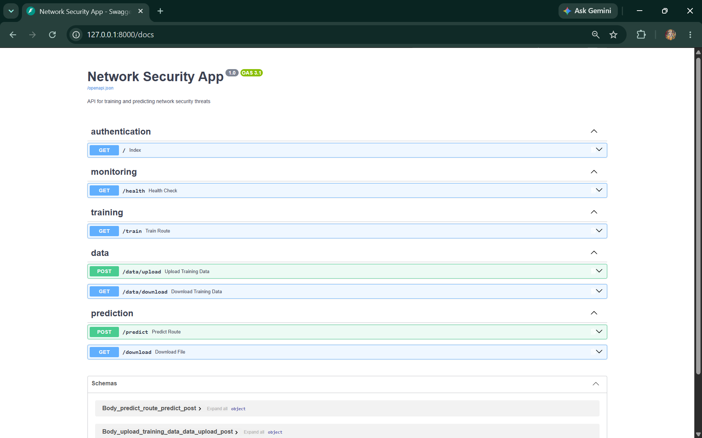

# Network Security Phishing Detection

## Dashboard Preview









**An end-to-end machine learning application for detecting phishing   websites from URL and webpage security features.**

The project combines:

- FastAPI APIs
- A browser dashboard
- MongoDB Atlas data storage
- Automated data ingestion, validation, transformation, and training
- KNN-based missing-value imputation
- MLflow and DagsHub experiment tracking
- Batch prediction from CSV files

## Application Flow

```mermaid
flowchart LR
    A[Training CSV] --> B[POST /data/upload]
    B --> C[MongoDB Atlas]
    C --> D[GET /train]
    D --> E[Data ingestion]
    E --> F[Data validation]
    F --> G[KNN imputation]
    G --> H[Model training]
    H --> I[final_model artifacts]
    I --> J[POST /predict]
    J --> K[Prediction CSV]
```



## ETL and Training Pipeline

The complete ETL workflow begins by loading CSV data into MongoDB, followed by four pipeline stages:

```text
CSV loading -> MongoDB Atlas -> Data Ingestion -> Data Validation -> Data Transformation -> Model Training
```

### 0. Load CSV Data into MongoDB

Implemented in [`push_data.py`](push_data.py).

The initial data-loading step reads a CSV file, converts each row into a MongoDB document, and inserts the documents into the `ANMOLAI.NetworkData` collection. The standalone utility uses:

```python
data = pd.read_csv(file_path)
records = list(json.loads(data.T.to_json()).values())
collection.insert_many(records)
```

For normal application use, `POST /data/upload` performs the safer replacement workflow: it validates the uploaded CSV before deleting the existing collection data and inserting the new records. After the data is in MongoDB, the four pipeline stages below process it.

### 1. Data Ingestion

Implemented in [`data_ingestion.py`](networksecurity/components/data_ingestion.py).

The ingestion stage reads the current dataset from the MongoDB Atlas collection configured by `ANMOLAI` and `NetworkData`. It then:

1. Converts MongoDB documents into a pandas DataFrame.
2. Removes MongoDB's `_id` field.
3. Converts literal `"na"` values into `np.nan`.
4. Saves a feature-store CSV under the timestamped `Artifacts/` directory.
5. Splits the dataset into training and testing CSV files using an 80/20 split.

The ingestion artifact contains the paths to the generated training and testing files.

### 2. Data Validation

Implemented in [`data_validation.py`](networksecurity/components/data_validation.py).

The validation stage reads the train and test CSV files and is responsible for:

- Checking dataset structure against `data_schema/schema.yaml`.
- Comparing train and test feature distributions with the Kolmogorov-Smirnov test.
- Writing a per-column drift report to the timestamped artifact directory.
- Writing validated train and test CSV files.

The drift threshold is `0.05`. A p-value below this threshold is reported as dataset drift.

### 3. Data Transformation

Implemented in [`data_transformation.py`](networksecurity/components/data_transformation.py).

The transformation stage:

1. Separates the `Result` target column from the input features.
2. Converts target labels of `-1` to `0`.
3. Fits a `KNNImputer` on the training features.
4. Applies the fitted imputer to both training and testing features.
5. Combines transformed features with the target column.
6. Saves NumPy arrays for model training.
7. Saves the fitted preprocessor to `final_model/preprocessor.pkl`.

The current imputer uses three neighbors and uniform weights:

```python
KNNImputer(
  missing_values=np.nan,
  n_neighbors=3,
  weights="uniform"
)
```

SMOTE is not currently enabled.

### 4. Model Training

Implemented in [`model_trainer.py`](networksecurity/components/model_trainer.py).

The training stage loads the transformed NumPy arrays and evaluates:

- Random Forest
- Decision Tree
- Gradient Boosting
- Logistic Regression
- AdaBoost

`GridSearchCV` is used for hyperparameter search. The selected model is evaluated with F1 score, precision, and recall. Metrics and model artifacts are logged to MLflow/DagsHub.

The test-evaluation run registers the selected classifier in the MLflow Model Registry on DagsHub with the registered model name:

```text
NetworkSecurityModelCombined
```

The latest local inference artifacts are:

```text
final_model/preprocessor.pkl
final_model/model.pkl
```

After training, the API reloads these artifacts so `/predict` uses the updated model.

### Pipeline Outputs

Each run creates a timestamped directory under `Artifacts/`:

```text
Artifacts/<timestamp>/
├── data_ingestion/
├── data_validation/
├── data_transformation/
└── model_trainer/
```

The timestamped folders preserve run history, while `final_model/` contains the latest inference artifacts.

> Implementation note: the validation stage currently generates reports and files, but its failure status should be hardened so invalid structure or drift explicitly stops the pipeline before transformation.

## Dashboard

Start the application and open:

```text
http://127.0.0.1:8000/
```

The dashboard provides controls for uploading a replacement training dataset, starting the training pipeline, downloading the current MongoDB dataset, uploading a prediction CSV, downloading prediction results, viewing health, and switching themes.

Interactive API documentation is available at:

```text
http://127.0.0.1:8000/docs
```

## API Workflow

### Upload training data

```http
POST /data/upload
```

The endpoint reads the CSV, validates the required schema columns, normalizes missing values to `np.nan`, rejects invalid numeric values and invalid `Result` labels, deletes the existing MongoDB data, and inserts the validated dataset.

The old dataset is replaced only after validation succeeds.

### Train the model

```http
GET /train
```

This runs the complete pipeline:

```text
MongoDB Atlas -> ingestion -> validation -> KNN imputation -> transformation -> training
```

The model and preprocessor are reloaded after training for prediction.

### Predict from a CSV

```http
POST /predict
```

Upload a feature-only CSV. The `Result` target column is not required for prediction.

To request JSON instead of the HTML table response, send:

```http
Accept: application/json
```

Example response:

```json
{
  "status": "success",
  "rows": 10,
  "prediction_count": 10,
  "download_link": "/download",
  "predictions": [1, -1, 1]
}
```

### Download MongoDB data

```http
GET /data/download
```

Exports the current MongoDB training collection as `network_training_data.csv`.

### Download predictions

```http
GET /download
```

Downloads the latest prediction output as `predictions.csv`.

## Data Schema

Training CSV files must contain the 30 phishing-detection feature columns and the `Result` target column. The authoritative schema is stored in [`data_schema/schema.yaml`](data_schema/schema.yaml).

The required columns are:

```text
having_IP_Address, URL_Length, Shortining_Service, having_At_Symbol,
double_slash_redirecting, Prefix_Suffix, having_Sub_Domain, SSLfinal_State,
Domain_registeration_length, Favicon, port, HTTPS_token, Request_URL,
URL_of_Anchor, Links_in_tags, SFH, Submitting_to_email, Abnormal_URL,
Redirect, on_mouseover, RightClick, popUpWidnow, Iframe, age_of_domain,
DNSRecord, web_traffic, Page_Rank, Google_Index, Links_pointing_to_page,
Statistical_report, Result
```

The current dataset uses `-1` and `1` labels. The upload validator also accepts `0`.

## Missing Values

Missing feature values follow this path:

```text
Blank or "na" value -> np.nan -> MongoDB -> KNNImputer -> transformed data
```

KNN imputation is applied to feature columns. Target values are not imputed and must be present. SMOTE is not currently enabled.

## Local Setup

Requirements:

- Python 3.10 or newer
- MongoDB Atlas connection string
- DagsHub/MLflow credentials when experiment tracking and model registry is enabled

Create an environment and install dependencies:

```powershell
python -m venv venv or conda create -p venv python
venv\Scripts\activate or conda activate venv/
pip install -r requirements.txt
```

Create a `.env` file in the project root:

```env
MONGO_DB_URL=your_mongodb_atlas_connection_string
MLFLOW_TRACKING_URI=your_mlflow_tracking_uri
MLFLOW_TRACKING_USERNAME=your_mlflow_username
MLFLOW_TRACKING_PASSWORD=your_mlflow_password
```

Do not commit credentials to source control. Rotate credentials that have previously been exposed in configuration files.

Run the application with:

```powershell
uvicorn app:app --reload
```

Then visit `http://127.0.0.1:8000/`.

## Repository Structure

```text
app.py                         FastAPI application and dashboard routes
push_data.py                   Standalone CSV-to-MongoDB utility
data_schema/schema.yaml        Training and validation schema
networksecurity/components/    Ingestion, validation, transformation, training
networksecurity/pipeline/      Training pipeline orchestration
networksecurity/entity/        Configuration and artifact entities
networksecurity/utils/         Serialization, metrics, and model utilities
final_model/                   Inference model and preprocessor artifacts
Artifacts/                     Timestamped training artifacts
templates/dashboard.html       Browser dashboard
templates/table.html           Prediction table response
```

## Health Check

```http
GET /health
```

Example:

```json
{
  "status": "ok",
  "mongodb": "ready",
  "model": "ready"
}
```

MongoDB readiness is checked with a database ping. Model readiness confirms that the inference model has been loaded.

## Docker

Build and run the container after providing environment variables securely:

```powershell
docker build -t network-security-app .
docker run --env-file .env -p 8000:8000 network-security-app
```

The application listens on port `8000`.

## Future Features

Planned improvements for the next versions include:

- **Stronger validation gates:** Stop the pipeline when schema validation or dataset drift checks fail.
- **Feature evolution:** Preserve and version newly uploaded columns so future models can train on old and new features together.
- **Complete model registry packages:** Register the classifier together with the preprocessor and feature contract in MLflow.
- **Training job management:** Add background jobs, progress tracking, cancellation, and protection against concurrent training runs.
- **Authentication and authorization:** Protect dataset replacement, training, download, and prediction endpoints.
- **Dataset versioning:** Keep previous MongoDB dataset versions and support rollback instead of replacing data permanently.
- **Automated testing:** Add unit, API, validation, transformation, and end-to-end pipeline tests.
- **Reproducible experiments:** Add fixed random seeds, dataset versions, model parameters, and feature metadata to each run.
- **Monitoring dashboard:** Display model metrics, drift reports, training history, and registered model versions.
- **Scalable prediction jobs:** Support large CSV files through asynchronous batch processing instead of one request.
- **Deployment hardening:** Move secrets entirely to deployment configuration and add health/readiness probes for production.

## Notes

- `/data/upload` replaces the current training dataset; it does not append to it.
- Validation occurs before existing MongoDB data is deleted.
- Call `/train` after `/data/upload` to train on the replacement dataset.
- The current MLflow registry call registers the selected classifier model; local inference uses the saved preprocessor and model artifacts.
